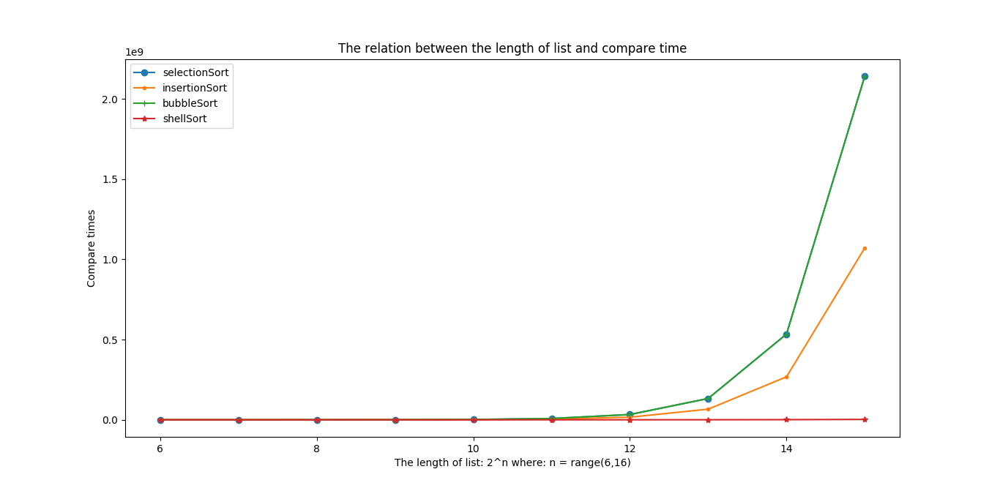
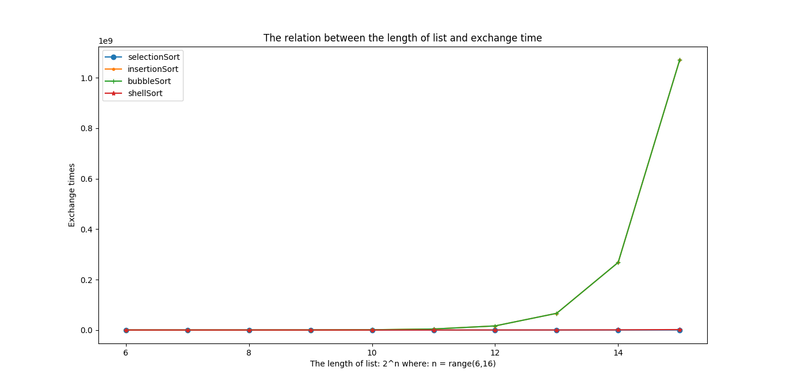
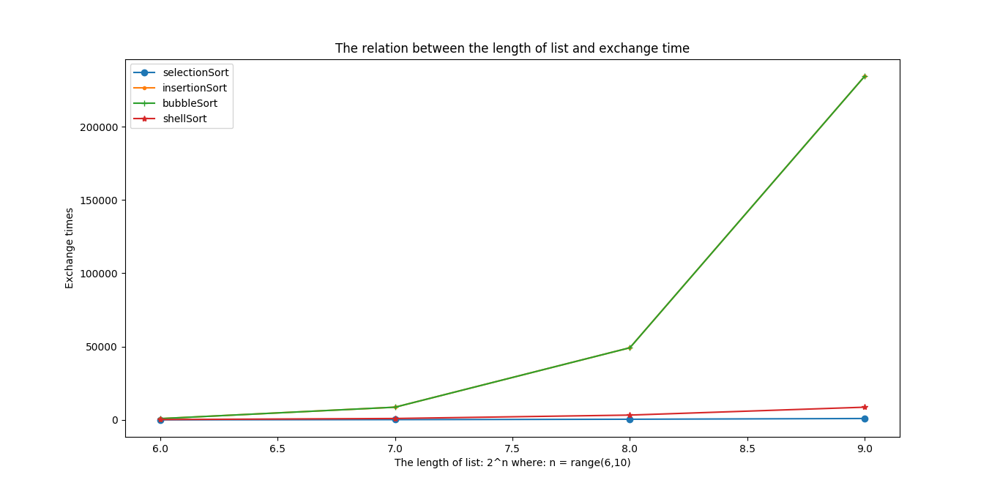
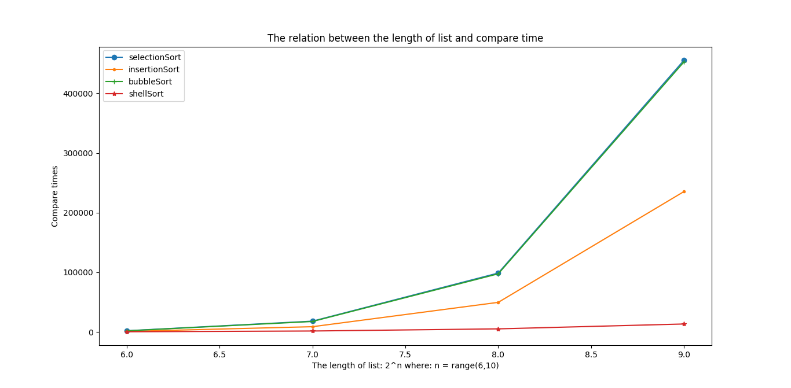

此文件夹中存放着排序相关的代码，具体的内容请关注我的公众号，点击 **历史消息** 进行查看

- `__init__.py` 中写有几个函数

- `primarySort.py` 中介绍了四种初级排序算法的 python 实现，分别是: **选择排序**， **插入排序**， **冒泡排序** 以及 **希尔排序**

程序的运行结果图：

**当 number = 16 时的结果图**

 

比较次数随长度的变化

 交换次数随长度的变化 

**当 number = 10 时的结果图**

比较次数随长度的变化

交换次数随长度的变化 